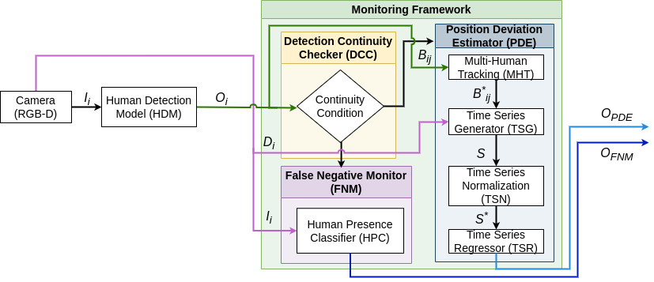

# DDOM (Data Driven Online Monitoring) System


## <u>Description</u>

This repo is a ROS Package which can be used for monitoring camera based Human Detection Modules.




## <u>Functioning</u>
### 1) The Framework consists of three components
- Position Deviation Estimation (_PDE_) :
    - Takes input of bounding boxes from the human detection model.
    - Creates a tracklet of the nearest person from the camera.
    - Estimates Deviation in tracklet of the nearest person detection by the human detection model.
    - Outputs the Estimated Deviation into a ROS topic (as a `float` message).

- False Negative Monitor (_FNM_) 
    - Takes RGB image input from a camera.
    - Classifies negative instances (no detection instances) from the human detection model into False Negative and True Negative.
    - Outputs the binary classification into a ROS topic (as a `bool` message).
 
- Detection Continuity Checker (_DCC_) :
    - Checks for continuity of output from the detection model.
    - Creates an alert notifying the non-continuity in output.
    - Changes the Active Monitoring Component between FNM and PDE.

## <u>Dependency</u>
- The Noetic branch of the repo depends on :  
    -   SENTOR System: https://github.com/lcas/sentor
    -   SORT Tracker: https://github.com/abewley/sort
-    The SENTOR is used as the _DCC_ for monitoring the human detection ros topic and publishes a boolean ROS message based on the continuity of detections from the human detection mdoel

-   The SORT is used as the tracker in the framework for generating the tacklet of the nearest person infront of the camera.

## <u>INSTALLATION AND USAGE</u>
- To install the framework :
    - clone the repo into a ROS workspace
    ```
    cd /path/to/workspace/src
    git clone https://github.com/hariharan20/ddom -b noetic 
    ```
    - install the dependencies :
    ```
    cd /path/to/workspace/src
    git clone https://github.com/lcas/sentor
    cd DDOM/tracker/src
    git clone https://github.com/abewley/sort
    cd /path/to/workspace/
    ```
    - build the workspace
    ```
    catkin_make
    ```
    - source the workspace
    ```
    source /path/to/workspace/devel/setup.bash
    ```
- Launch the framework :
```
roslaunch ddom ddom_v2.launch 
```

- Topic names and path to models are set in a config file located at   
/path/to/workspace/src/DDOm/ddom/config/config_v2.yaml
- Change the config file for custom topic names and camera-specific parameters. 

